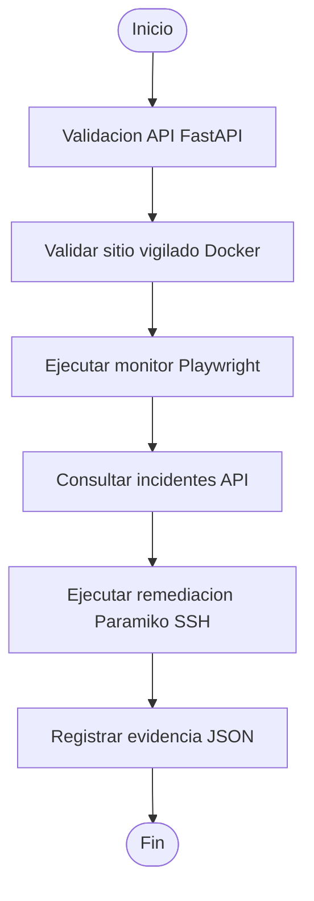

# Flujo Rocketbot para Defensa de Tesis

## Objetivo

Preparar una demostracion visual en Rocketbot Studio donde Rocketbot actue como capa RPA principal del prototipo de observabilidad sintetica y auto-remediacion.

El robot recomendado no reemplaza los modulos existentes. Su funcion es orquestar visualmente el flujo y ejecutar el archivo:

```text
rocketbot\ejecutar_flujo_completo.bat
```

Ese archivo invoca:

```text
rocketbot\robot_observabilidad.py
```

## Flujo recomendado para Rocketbot Studio

1. Inicio
2. Validacion API
3. Validacion sitio vigilado Docker
4. Ejecucion monitor Playwright
5. Consulta incidentes API
6. Ejecucion remediacion SSH real
7. Registro evidencia
8. Fin

## Diagrama Mermaid del flujo



## Construccion paso a paso en Rocketbot Studio

### 1. Crear robot

1. Abrir Rocketbot Studio.
2. Crear un nuevo robot llamado:

```text
Robot_Observabilidad_Tesis
```

3. Guardar el robot dentro del proyecto o en el workspace de Rocketbot.

### 2. Crear variable de ruta del prototipo

Crear una variable llamada:

```text
RUTA_PROTOTIPO
```

Valor sugerido durante la defensa:

```text
C:\Users\bryan\OneDrive\Desktop\Proyecto Tesis - Monotoreo\tesis-observabilidad\prototipo
```

Nota: el codigo del robot no usa rutas absolutas. Esta variable es solo para que Rocketbot Studio pueda ubicarse visualmente en la carpeta correcta al ejecutar el `.bat`.

### 3. Paso Inicio

Agregar una accion de log o mensaje con el texto:

```text
Iniciando flujo de observabilidad sintetica y auto-remediacion
```

Evidencia esperada:

```text
Mensaje visible en consola/log de Rocketbot Studio.
```

### 4. Paso Validacion API

Agregar una accion para ejecutar comando externo.

Comando:

```bat
cmd.exe
```

Argumentos:

```bat
/c curl http://localhost:8000/
```

Resultado esperado:

```json
{"mensaje":"API de observabilidad sintetica activa","estado":"ok"}
```

Si Rocketbot Studio no tiene `curl` disponible, usar directamente el flujo completo del paso 7, porque `robot_observabilidad.py` tambien valida la API.

### 5. Paso Ejecucion monitor Playwright

Agregar una accion de ejecucion de comando externo.

Comando:

```bat
cmd.exe
```

Argumentos:

```bat
/c cd /d "%RUTA_PROTOTIPO%" && venv\Scripts\python.exe playwright-monitor\monitor.py
```

Resultado esperado:

```text
El monitor muestra estado OK o registra un incidente si la URL falla.
```

### 6. Paso Consulta incidentes API

Agregar una accion de ejecucion de comando externo.

Comando:

```bat
cmd.exe
```

Argumentos:

```bat
/c curl http://localhost:8000/incidentes
```

Resultado esperado:

```text
Lista JSON de incidentes registrados.
```

### 7. Paso Ejecucion remediacion

Agregar una accion de ejecucion de comando externo.

Comando:

```bat
cmd.exe
```

Argumentos:

```bat
/c cd /d "%RUTA_PROTOTIPO%" && venv\Scripts\python.exe remediacion\remediador.py
```

Resultado esperado:

```text
Conexion SSH exitosa o fallida, resultado del comando y registro en POST /incidentes.
```

### 8. Paso Registro evidencia

Para la demostracion principal, agregar una accion final que ejecute el orquestador completo.

Comando:

```bat
cmd.exe
```

Argumentos:

```bat
/c cd /d "%RUTA_PROTOTIPO%" && rocketbot\ejecutar_flujo_completo.bat
```

Resultado esperado:

```text
Se genera un archivo JSON en evidencias\rocketbot\
```

### 9. Paso Fin

Agregar una accion de log o mensaje:

```text
Flujo Rocketbot finalizado. Revisar dashboard y evidencia JSON.
```

## Preparacion antes de la defensa

### Levantar API y MySQL

Desde la raiz del prototipo:

```powershell
docker compose -f docker/docker-compose.yml up --build -d
```

Validar:

```powershell
Invoke-RestMethod http://localhost:8000/
```

### Validar dashboard

Abrir:

```text
dashboard\index.html
```

### Validar sitio de prueba

Desde `sitio-prueba`:

```powershell
docker compose -f docker/docker-compose.yml up --build -d sitio-vigilado
```

URL:

```text
http://127.0.0.1:8080
```

## Evidencias para capturar durante la presentacion

| Evidencia | Como obtenerla | Archivo o vista esperada |
| --- | --- | --- |
| Robot ejecutado | Ejecutar `rocketbot\ejecutar_flujo_completo.bat` desde Rocketbot Studio y capturar pantalla del log | Pantalla de Rocketbot Studio con pasos ejecutados |
| Dashboard actualizado | Abrir `dashboard\index.html` despues de ejecutar el flujo | Tabla con incidentes y total actualizado |
| Incidente generado | Ejecutar `Invoke-RestMethod http://localhost:8000/incidentes` | JSON con registros nuevos |
| Remediacion ejecutada | Revisar salida del paso `Ejecutar remediador Paramiko` | Mensaje de conexion exitosa o fallida y registro en API |
| Evidencia JSON creada | Abrir carpeta `evidencias\rocketbot\` | Archivo `evidencia_rocketbot_YYYYMMDD_HHMMSS.json` |

## Capturas recomendadas

Guardar las capturas en:

```text
evidencias\rocketbot\
```

Nombres sugeridos:

```text
01_rocketbot_studio_flujo.png
02_rocketbot_ejecucion_log.png
03_dashboard_actualizado.png
04_api_incidentes_json.png
05_evidencia_json_creada.png
06_remediacion_resultado.png
```

## Comando unico para demostracion

Desde la raiz del prototipo:

```powershell
.\rocketbot\ejecutar_flujo_completo.bat
```

Este comando:

1. valida la API;
2. abre el dashboard;
3. ejecuta Playwright;
4. ejecuta Paramiko;
5. crea evidencia JSON.

## Checklist de defensa

- API activa.
- Dashboard visible.
- Monitor ejecutado.
- Incidente registrado.
- Remediacion ejecutada.
- Evidencia JSON creada.
- Rocketbot Studio ejecutando el `.bat`.

## Revision de funcionalidades prometidas

| Funcionalidad Prometida | Implementada | Archivo Responsable | Estado |
| --- | --- | --- | --- |
| API FastAPI activa | Si | `api/main.py` | Implementada |
| Endpoint `GET /` | Si | `api/main.py` | Implementada |
| Endpoint `GET /incidentes` | Si | `api/main.py` | Implementada |
| Endpoint `POST /incidentes` | Si | `api/main.py` | Implementada |
| Endpoint `POST /incidentes/demo` | Si | `api/main.py` | Implementada |
| Persistencia MySQL con Docker | Si | `docker-compose.yml`, `Dockerfile`, `api/database.py` | Implementada |
| Espera de MySQL antes de crear tablas | Si | `api/database.py` | Implementada |
| Dashboard web de incidentes | Si | `dashboard/index.html` | Implementada |
| Monitor sintetico Playwright | Si | `playwright-monitor/monitor.py` | Implementada |
| Registro automatico de incidente desde Playwright | Si | `playwright-monitor/monitor.py`, `api/main.py` | Implementada |
| Sitio web de prueba | Si | `sitio-prueba/index.html`, `sitio-prueba/estado.html`, `sitio-prueba/error.html`, `sitio-prueba/Dockerfile` | Implementada |
| Remediacion Paramiko por SSH | Si | `remediacion/remediador.py`, `docker/Dockerfile.ssh`, `docker/docker-compose.yml` | Implementada contra contenedor `ssh-remediacion` |
| Registro de resultado de remediacion en API | Si | `remediacion/remediador.py` | Implementada |
| Rocketbot como orquestador | Si | `rocketbot/robot_observabilidad.py`, `rocketbot/ejecutar_flujo_completo.bat` | Implementada |
| Ejecucion visual dentro de Rocketbot Studio | Parcial | `rocketbot/ejecutar_flujo_completo.bat`, este documento | Preparada; requiere configurar acciones en Rocketbot Studio |
| Evidencia JSON del flujo Rocketbot | Si | `rocketbot/robot_observabilidad.py`, `evidencias/rocketbot/` | Implementada |
| Remediacion ejecutada automaticamente desde Rocketbot ante incidente especifico | Parcial | `rocketbot/robot_observabilidad.py` | Orquesta remediacion, pero no aplica reglas condicionales por tipo de incidente |
| Autenticacion de usuarios | No | No aplica | No implementada por alcance del MVP |
| Dockerizacion de Rocketbot | No | No aplica | No implementada |

## Observaciones tecnicas para defensa

- La integracion de Rocketbot esta lista como orquestacion funcional mediante `.bat`.
- La ejecucion visual depende de configurar las acciones dentro de Rocketbot Studio.
- La remediacion Paramiko es demostrable incluso con fallo SSH, porque registra el error en la API como evidencia controlada.
- La remediacion exitosa se demuestra con el contenedor `ssh-remediacion` expuesto en `127.0.0.1:2222`.
