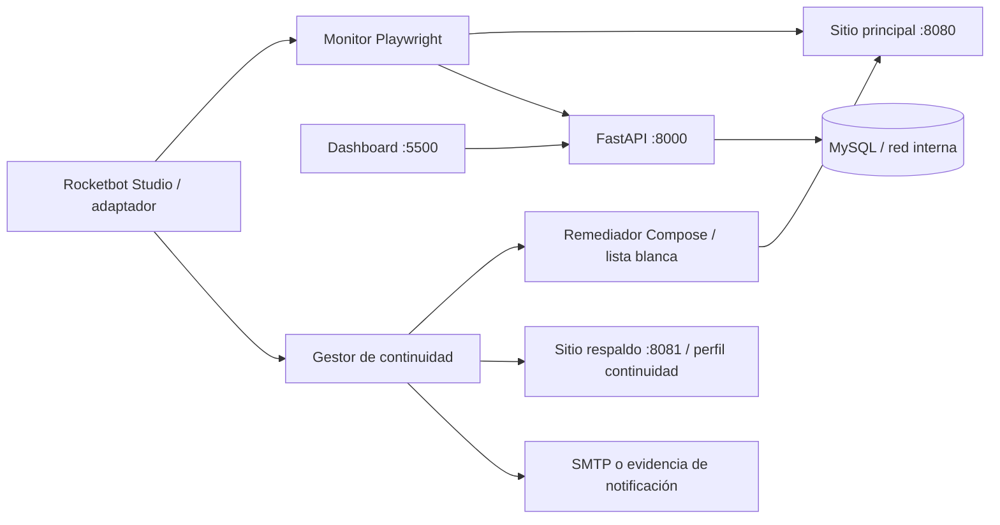

# Arquitectura verificada

## Decisiones

- FastAPI valida y autentica escrituras; las lecturas son paginadas.
- MySQL vive en una red Docker interna y no expone `3306` al host.
- El monitor diferencia disponibilidad HTTP de contenido correcto y captura evidencia.
- El remediador usa una lista blanca y recrea únicamente `sitio-vigilado`.
- El respaldo pertenece al perfil `continuidad`; no se inicia en operación normal.
- Rocketbot es la capa RPA de invocación. La lógica comprobable permanece en Python.

## Límites de confianza

La API no es un sistema multiusuario: existe una credencial técnica para escritura,
no identidades humanas ni autorización por roles. La gestión de Docker se ejecuta
desde el host, deliberadamente, para no entregar el socket privilegiado a un
contenedor. Rocketbot Studio debe configurarse para invocar el `.bat`; el repositorio
no contiene un robot propietario exportado, por lo que no se afirma que esa interfaz
visual esté automatizada sin dicha configuración.
