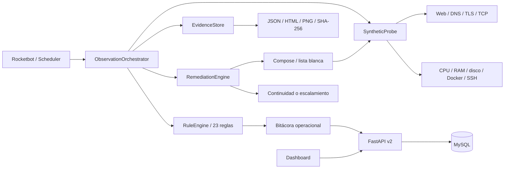

# Arquitectura Fase 1

## Capas

1. **Dominio:** observaciones, detecciones, eventos y resultados, sin FastAPI.
2. **Aplicación:** orquestación, continuidad y políticas de remediación.
3. **Infraestructura:** Playwright, psutil, sockets, Docker, HTTP, evidencia y MySQL.
4. **Adaptadores:** API, dashboard, CLI, `.bat` y Rocketbot Studio.

La lógica privilegiada vive fuera de los contenedores para evitar montar el socket
Docker. Las reglas pueden detectar múltiples fallas en una observación y la estrategia
de mayor severidad gobierna la acción automática. Todas las detecciones conservan su
propio evento y evidencia.
