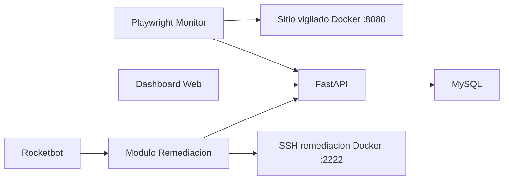
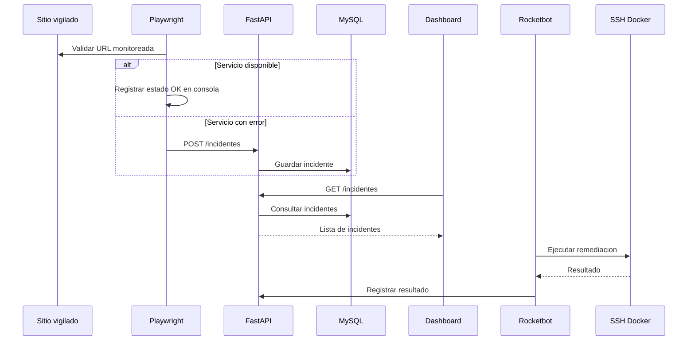

# Arquitectura del Prototipo

## Descripcion general

El prototipo implementa un flujo minimo de observabilidad sintetica y auto-remediacion. Un sitio web vigilado en Docker actua como objetivo controlado. Playwright monitorea su disponibilidad, registra incidentes en una API FastAPI y la API persiste la informacion en MySQL Docker. El dashboard consulta la API para visualizar incidentes. Rocketbot orquesta el flujo completo y Paramiko ejecuta una remediacion SSH real contra un contenedor de laboratorio.

Flujo final esperado:

```text
Sitio vigilado Docker -> Playwright -> FastAPI -> MySQL -> Dashboard -> Rocketbot -> Paramiko/SSH Docker
```

## Diagrama de componentes



## Diagrama de flujo


