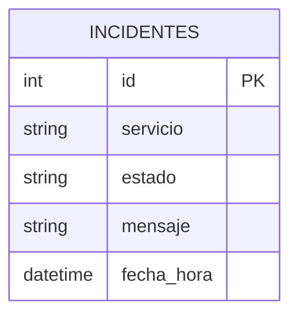

# Modelo de Datos

## Tabla `incidentes`

La tabla `incidentes` almacena eventos generados por la API, Playwright y el modulo de remediacion.

| Campo | Tipo | Descripcion |
| --- | --- | --- |
| `id` | Integer | Identificador unico del incidente. Clave primaria. |
| `servicio` | String(100) | Nombre del servicio o modulo que reporta el evento. |
| `estado` | String(50) | Estado del incidente o evento, por ejemplo `ok`, `error`, `abierto`. |
| `mensaje` | String(1000) | Descripcion del evento registrado. |
| `fecha_hora` | DateTime | Fecha y hora de creacion del registro. |

## Modelo ER

## Consideraciones

- La persistencia oficial del prototipo es MySQL en Docker.
- La API usa `DATABASE_TYPE=mysql`.
- La base de datos se llama `observabilidad`.
- El contenedor MySQL expone el puerto `3306`.
