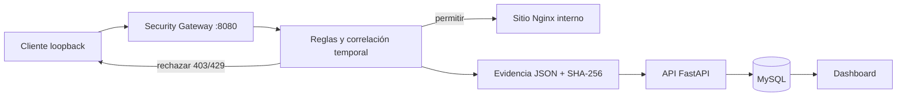

# Security Watcher: diseño defensivo

## Propósito y frontera

Security Watcher es una capa defensiva educativa situada delante del sitio vigilado. Detecta patrones comunes, rechaza solicitudes en escenarios controlados y deja trazabilidad. No sustituye WAF, SIEM ni SOC.

## Flujo

El sitio Nginx no publica puerto en el host. El único acceso de demostración pasa por el gateway, publicado exclusivamente en `127.0.0.1:8080`.

## Reglas y respuestas

Las ventanas están en `config/security_rules.json`.

| Patrón | Técnica | Respuesta |
|---|---|---|
| Flood HTTP | solicitudes por origen/ventana | HTTP 429 y rate limit local |
| Fuerza bruta simulada | POST repetidos a login/auth | bloqueo temporal |
| Escaneo de rutas | rutas únicas por origen/ventana | bloqueo temporal |
| SQL Injection básica | expresiones regulares acotadas | rechazo y bloqueo temporal |
| XSS básico | expresiones regulares acotadas | rechazo y bloqueo temporal |
| User-Agent sospechoso | firmas explícitas | rechazo y escalamiento humano |

Los bloqueos duran 60 segundos por defecto, viven solo en memoria y desaparecen al reiniciar. No se crean reglas de firewall ni bloqueos permanentes.

Cada detección crea un evento de nivel `seguridad`, evidencia JSON con SHA-256 y un intento de remediación. La observación se limita en tamaño y redacta campos sensibles como contraseña, token y autorización antes de persistirlos.

## Controles

- cuerpo máximo: 64 KiB y upstream con timeout;
- contenedor sin capacidades, `no-new-privileges` y filesystem de solo lectura;
- API de escritura protegida por clave interna;
- sitio real no expuesto directamente;
- ninguna ejecución de shell ni payload ofensivo;
- modo demo disponible solo mediante el puerto ligado a loopback.
